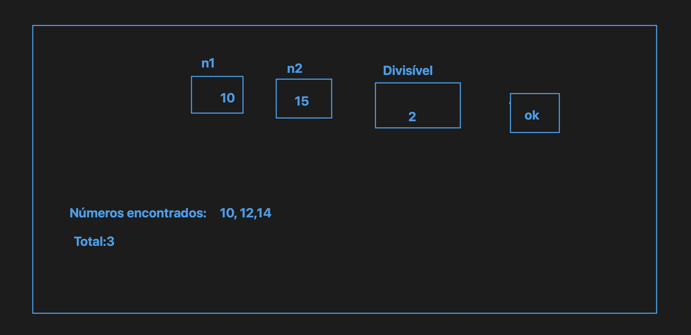

#ex1

Faça um programa que leia um numero (digitado na tela) da tela e imprima uma sequencia numerica de 0 até o numero digitado. EX: 5 o programa deve imprimir 0, 1, 2, 3, 5 .... OK

Faça um programa que leia um numero da tela e imprima uma sequencia numerica de 0 até o numero digitado. EX: 5 o programa deve imprimir -1, -2, -3, -5 .... ( negativo) OK

Faça um programa contendo apenas 1 botao e um campo (input). Mostrar numeros pares de 1 até o número digitado OK

Faça um programa contendo apenas 1 botao e um campo (input). Mostrar numeros impares de 1 até o numero digitado OK

Faça um programa que leia um dado digitado na tela. (soma progressiva) 0+1+2+3+4+5 = 15 OK

Quantos (pares) existem um 1 e um numero digitado no campo // OK

Quantos (impares) existem entre 1 e um um numero digitado no campo

Quantos (pares) existem um intervalo de números N1 e N2 digitado pelo usuário // OK

Quantos (Ímpares) existem um intervalo de números N1 e N2 digitado pelo usuário // OK

Quantos números são divisiveis por 3 entre 1 e um numero N digitado no campo pelo utilizador.

Quantos números são divisiveis por um Número qualquer "n" entre um intervalo de "n1" a "n2" digitado pelo usuário utilizador. [3 inputs]

